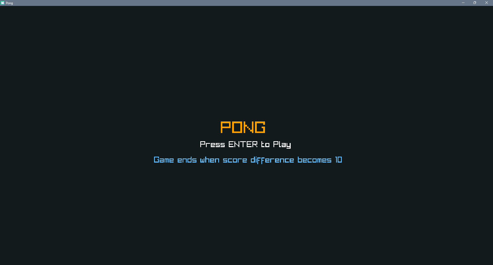
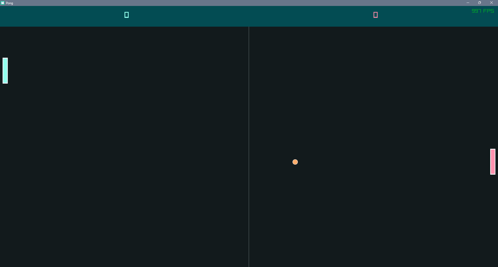
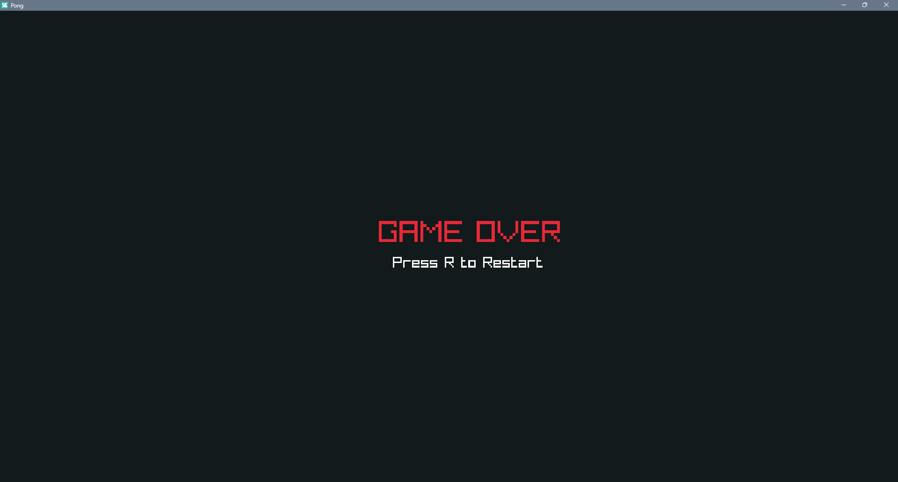

# Pong Game with Raylib

A simple Pong game implemented in C++ using the [raylib](https://www.raylib.com/) library.

## Features

- Classic Pong gameplay
- Smooth, frame-rate-independent movement
- Ball bounces off screen edges
- FPS display

## Screenshots

Menu Screen


Game Screen


Menu Screen


## Requirements

- C++ compiler (e.g., g++, clang++)
- CMake (for building the project)

## Build and Run

### 1. Clone the repository

```sh
git clone https://github.com/rahulc0dy/pong-game-with-raylib.git
cd pong-game-with-raylib
```

### 2. Build the project

```sh
mkdir build
cd build
cmake ..
cmake --build .
```

### 3. Run the game

```sh
./pong-game-with-raylib
```

_On Windows, the executable may be named `pong-game-with-raylib.exe`._

## Controls

- Use the keyboard to control paddles
- Watch the ball bounce and try to keep it in play!

## Notes

- Raylib is included as a dependency [ Windows only ]
- If you are on Linux or macOS, you may need to install raylib separately. Download it from
  the [raylib website](https://www.raylib.com/) and follow the installation instructions for your platform.

---

Enjoy playing Pong!